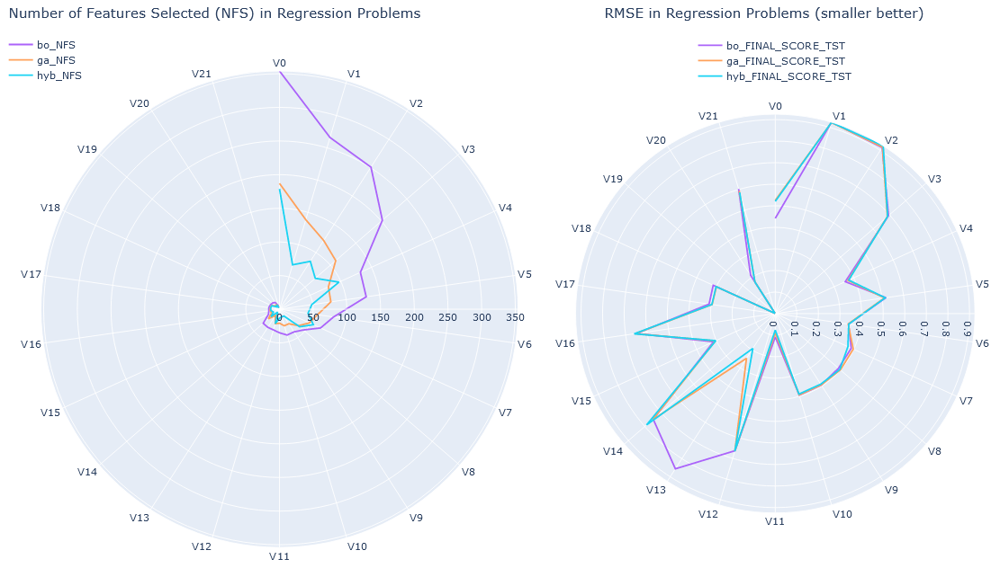
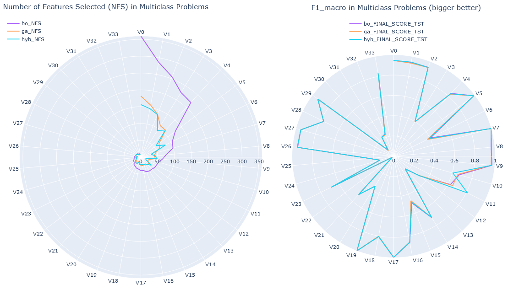

# Comparative of HYBparsimony vs Bayesian Optimization and a three-step method based on Genetic Algorithms for Feature Selection

[Comparative_3Methods.ipynb](Comparative_3Methods.ipynb) notebook presents the results of comparing HYB-PARSIMONY with two other methods: Bayesian Optimization (BO) utilizing all features (*num\_cols*) and a classical three-step methodology based on GA for feature selection (more info in the notebook).

In these experiments, half of the instances from each dataset were used for training/validation, while the remaining half constituted the test dataset to assess the generalization capabilities of the models. The results represent the average values obtained from five runs of each methodology, each with different random seeds. 5-fold cross-validation was performed in all methods.

All the results are based on 100 datasets, covering binary (44), multiclass (34), and regression (22) problems, which were sourced from [openml.org](https://www.openml.org/).

To replicate results:

1. Download datasets from [openml.org](https://www.openml.org/) with [Download_Datasets.ipynb](Download_Datasets.ipynb) notebook.
2. Execute [HybComparative.py](HybComparative.py) to obtain results with HYB_PARSIMONY.
3. Execute [BOComparative.py](BOComparative.py) to obtain results with Bayesian Optimization.
4. Execute [SKGENETICSComparative.py](SKGENETICSComparative.py) to obtain results with $sklearn-genetic-opt$ package.
5. See results with [Comparative_3Methods.ipynb](Comparative_3Methods.ipynb) notebook.

